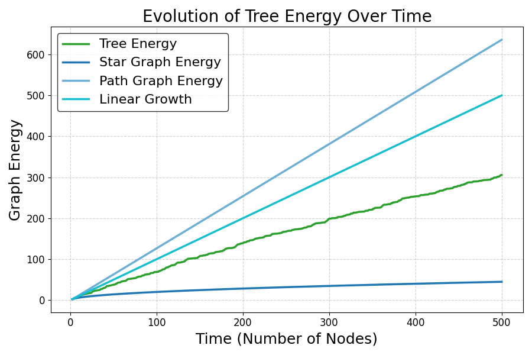
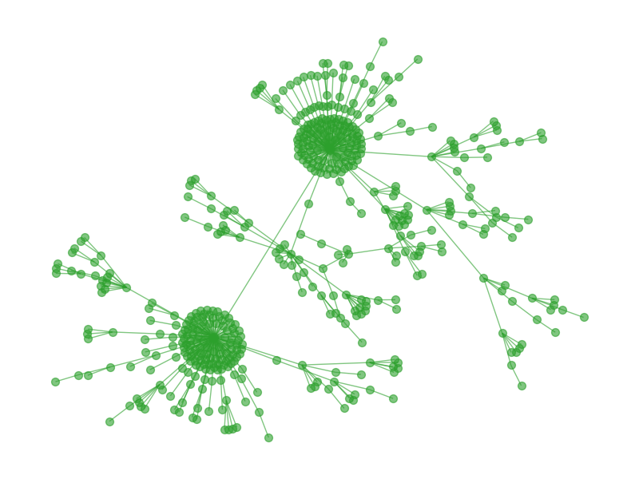

# Preferential Attachment Tree Model Simulation 🌳

This project simulates **random trees** using the **Preferential attachment model** and analyzes their properties. It generates trees, computes their energy statistics, and visualizes their structure.

---

## 📌 Features
✅ Generate **Preferential Attachment Trees** using two different methods:
   - Preferential attachment using a custom attachment kernel (`generate_barabasi_albert_tree`)
   - Random recursive trees (`generate_random_recursive_tree`)

✅ Visualize:
   - **Tree structures**
   - **Energy/time ratio statistics**
   - **Eigenvalue distributions**
   - **Energy evolution over time**

✅ Selectable **modes** to **easily switch between different analyses**.

---

## 🚀 Installation
To install the required dependencies, run:

```bash
pip install -r requirements.txt
```
---

## 📂 Project Structure
```
📂 BA_Tree_Simulation/
│── main.py                  # Runs the full simulation
│── generate_trees.py         # Contains tree generation functions
│── energy_analysis.py        # Computes energy and eigenvalues
│── plotting.py               # All visualization functions
│── utils.py                  # Utility functions (weight functions)
│── config.py                 # Configuration parameters
│── requirements.txt          # Required Python packages
│── gamma.py                  # Numerical computation helper
│── README.md                 # Project documentation
```

---

## ⚙️ Configuration Parameters (`config.py`)

Modify `config.py` to customize the simulation.

### **🔹 Explanation of Parameters:**
- `iterations`: Number of **Monte Carlo simulations** to compute statistics.
- `node_count`: Number of **nodes in the generated tree**.
- `alpha`: Controls **how preferential attachment scales** (for power function).
- `delta`: Offset parameter for **affine weight function**.
- `weight`: Choose the attachment model:
  - `'power'` → Uses **w(d) = d^alpha**
  - `'affine'` → Uses **w(d) = d + delta**
- `mode`: Selects the **type of analysis** to run.
---

### Available Modes

The `mode` variable in `config.py` determines which type of analysis will be executed.  

| Mode Enum                          | Description |
|------------------------------------|------------------------------------------------|
| `Mode.ENERGY_TIME_RATIO`           | Computes and plots the energy-to-time ratio histogram. |
| `Mode.ENERGY_EVOLUTION`            | Computes and plots the energy evolution over time. |
| `Mode.SCALED_ENERGY_EVOLUTION`     | Computes and plots the scaled energy evolution. |
| `Mode.EIGENVALUES`                 | Computes and plots the eigenvalue distribution of the tree. |
| `Mode.AVERAGED_EIGENVALUES`        | Computes and plots the averaged eigenvalue distribution from multiple trees. |
| `Mode.DRAWING`                     | Visualizes the generated tree structure. |
| `Mode.ENERGY_RANDOM_RECURSIVE_TREES` | Computes a lower bound approximation for the energy of random recursive trees. |


## 🎮 Usage

### **Running the Simulation**
Modify `mode` in `config.py`, then run:

```bash
python main.py
```
---

## 📊 Output Examples

### **1️⃣ Energy Evolution Over Time**


### **2️⃣ Tree Visualization**


---
